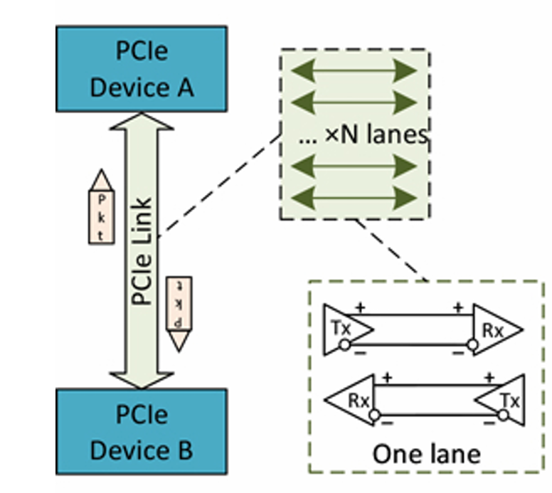
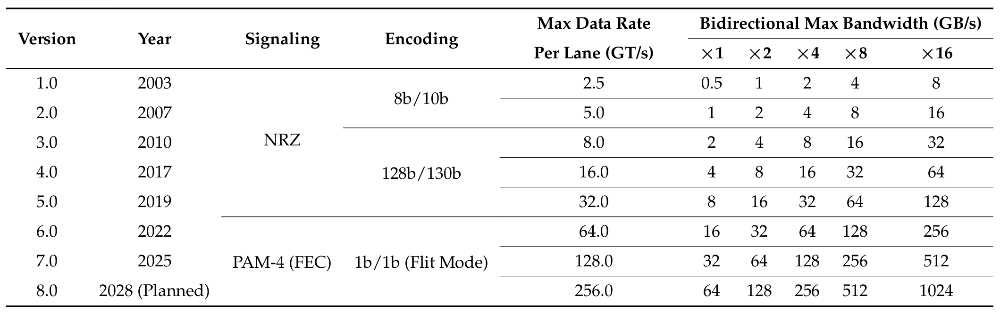
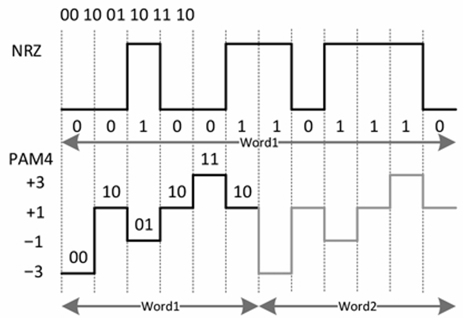

[TOC]

# NOTE

> 2026.4.24-2026.5
>
> Survey of Intra-Node GPU Interconnection in Scale-Up Network Challenges, Status, Insights, and Future Directions
>
> https://www.mdpi.com/1999-5903/17/12/537

## scale-up 网络 / HBD（高带宽域）的四种核心特征

### 极高带宽（High Bandwidth）

多 GPU 之间要频繁交换梯度、参数和中间结果，如果带宽不够就会拖慢整体算力利用率。
 要求是：

* GPU 端口带宽达到 **400Gb/s ~ 800Gb/s** 甚至更高

* 单 GPU 数据吞吐可达 **数百 GB/s** 甚至 TB/s 级别

* 目标是匹配 HBM（高带宽内存）的速度

> 本质：网络不能成为 GPU 算力的“瓶颈木桶短板”。

### 超低延迟（Ultra-low Latency）

强调通信必须“几乎实时”：

- 单跳交换机延迟：**几百纳秒**
- GPU 间 RTT：**微秒级**

意义：

- 加速分布式训练中的梯度同步
- 避免 GPU 因等待数据而空转
- 提升推理实时性和整体吞吐

> 本质：让多 GPU 像“一个巨型 GPU”一样工作。

### 可扩展性（Scalability）

随着 GPU 数量增加（比如一个节点 8 卡甚至更多）：

- 需要支持更大规模 GPU 集群扩展
- 避免过多跨节点通信（scale-out 开销）
- 减少协议转换和调度复杂度

例子：

- DeepSeek-V3 这种 8 GPU/节点架构，如果 scale-up 范围太小，会浪费算力和增加通信开销

> 本质：把更多通信“留在节点内部”，减少跨节点成本。

### 无损传输（Lossless）

多 GPU 协同对数据可靠性要求极高：

- 不能丢包、不能出错
- 出问题必须快速恢复
- 否则会导致重传、性能下降甚至训练不稳定

关键技术：

- 流量控制（防拥塞）
- 重传机制（恢复丢失数据）

> 本质：通信必须“稳定可靠”，否则整个训练会抖。

------

## 统一内存寻址（Unified Memory Addressing，UMA） 

统一内存寻址（UMA）是扩展网络的另一个核心要求，旨在解决协作计算效率的关键瓶颈，特别是那些源于存储资源隔离和“内存墙”现象的瓶颈[20,42]。

------


# **传统解决方案**

## Peripheral Component Interconnect Express （PCIe）

如图所示，一条PCIe链路由多个通道组成，每个通道由一对差分信号对（一个用于发送，一个用于接收）组成，从而实现全双工通信。PCIe链路可以灵活配置为×N（其中N表示通道数，例如×1、×4和×16），以平衡成本和性能要求。



### 各代PCIe规格



### PCIe 6.0

采用**四脉冲振幅调制（4-Level Pulse Amplitude Modulation，PAM4）**替代**传统非归零编码（Non-Return-to-Zero encoding，NRZ）**



### PCIe的局限性

#### 1、拓扑结构限制（架构问题）

- PCIe 采用 **Root Complex + 树形拓扑**
- 不支持环形/复杂拓扑（为了兼容性）
- GPU 之间 **不能直接通信（P2P受限）**
- 通信必须经过：
  - CPU（Root Complex）或PCIe Switch

> 结果：
>
> - 多一跳 → **延迟增加**
> - 占用 CPU / Switch 资源
> - 扩展性差（规模上不去）

#### 2、扩展能力有限

- PCIe lane 数量有限
- Switch 级联可扩展，但复杂且会导致效率下降

- 大规模 GPU 集群难以高效互联

#### 3、带宽严重不匹配（核心瓶颈）

GPU 本地显存带宽（HBM/GDDR）极高：

- H100：≈ 3350 GB/s
- MI300X：> 5000 GB/s

PCIe 带宽远低于显存带宽

>结果：
>
>- GPU ↔ GPU 数据传输成为瓶颈
>- 高性能计算效率被 PCIe 卡住

#### 4、内存模型不统一

- 每个 GPU 有**独立地址空间**
- 没有真正的共享内存池
- 不支持统一内存一致性（coherence）

>  结果：
>
> - 跨 GPU 访问需要软件同步
> - 额外开销大
> - 编程复杂、效率低

------

## Compute Express Link（CXL）

Compute Express Link 是在 PCI Express 基础上发展起来的**高速缓存一致性互连协议**，旨在解决PCIe在**内存扩展和一致性**方面的不足。

### 协议结构

CXL包含三种语义：

- **CXL.io**
  - 类似PCIe的I/O协议，用于设备管理与初始化
- **CXL.cache**
  - 支持设备访问CPU缓存，实现缓存一致性
- **CXL.mem**
  - 支持主机访问设备内存（load/store语义）

> 本质：让外部设备像内存一样被访问

### 核心能力

- 支持**缓存一致性（cache coherence）**
- 支持**内存扩展（memory expansion）**
- 支持**内存池化（memory pooling）**
- 支持CPU、GPU、NIC、DPU等多设备共享内存

> 目标：构建统一的内存访问模型

### 工作机制

- 基于PCIe物理层传输

- 将设备（EP）映射到**可缓存内存空间**

- CPU/GPU可通过**标准load/store指令**直接访问设备内存

### 优势

- 缓解PCIe的内存访问瓶颈
- 减少数据拷贝开销
- 提升异构计算协同效率

### 局限性

#### 1、仍受PCIe物理层限制

- 带宽有限

- 延迟较高

> 无法匹配GPU高显存带宽（HBM）

#### 2、数据路径较长

- GPU ↔ CXL内存访问路径复杂
- 相比CPU本地访问开销更大

> 导致AI场景性能收益有限

#### 3、不适用于GPU高效互联

- 不提升GPU之间P2P通信能力
- 无法替代专用互连（如NVLink）

#### 4、架构复杂

- 需兼容PCIe生态

- 协议与系统设计较为臃肿

### 定位总结

- ✔ 适用于：内存扩展、资源解耦（disaggregated memory）
- ❌ 不适用于：scale-up高带宽GPU互连网络

> 本质：CXL解决的是“内存问题”，而不是“GPU通信问题”

------

## 基于以太网的解决方案（Ethernet-Based Solutions）

以太网方案，尤其是基于 Remote Direct Memory Access 的RoCE（RDMA over Converged Ethernet），曾被广泛用于分布式通信，但在GPU **scale-up / HBD（高带宽域）网络**中存在明显不足。

### 基本问题：不适用于scale-up

- RoCE 和标准 Ethernet 并非为 GPU scale-up 网络设计
- 在以下方面存在瓶颈：
  - 通信流程复杂
  - 协议开销过大
  - 延迟高

### RoCE通信流程复杂（关键瓶颈）

RoCE基于**消息语义（message semantics）**，通信流程涉及多阶段操作：

- GPU侧准备数据
- 写入 Work Queue Elements（WQEs）
- NIC处理队列
- doorbell通知机制触发传输
- 等待确认（acknowledgment）

👉 每一步都会带来开销：

- GPU需要先**拷贝数据**
- 需要维护WQE
- 需要触发doorbell
- NIC参与调度

📌 结果：

- 单次通信延迟达到**微秒级**
- 多步骤流程导致通信效率低

### PCIe依赖导致进一步瓶颈

RoCE工作流依赖主机侧 PCI Express：

- NIC ↔ CPU ↔ GPU 数据路径长
- PCIe带宽与延迟限制显著
- GPU数量增加时问题加剧

👉 结果：

- 通信无法随GPU scale线性扩展
- 成为系统瓶颈

### 并行化带来的副作用

虽然可以通过并行请求降低延迟：

- 多WQE并行提交
- 多队列并发执行

但会导致：

- ❌ 内存占用增加（buffer膨胀）
- ❌ 发送缓冲区变大
- ❌ 系统资源压力上升

👉 结果：牺牲可扩展性换性能

### 协议开销问题（核心问题之一）

Ethernet / RoCE存在明显协议开销：

#### Ethernet基础开销

- frame结构包含：
  - preamble
  - header
  - FCS

#### RDMA额外开销

- control header增加：
  - addressing信息
  - Queue Pair管理信息

### scale-up场景下的问题放大

在GPU scale-up中：

- 通信特点：
  - 小数据包频繁交换s
  - 参数同步频繁
  - fine-grained communication

👉 导致：

- header / payload 比例过高
- 有效数据占比下降
- 带宽浪费严重
- 延迟上升

### 总结

- RoCE在scale-out场景有效（大数据传输）
- 但在scale-up GPU通信中：

👉 主要问题：

- 多阶段通信流程复杂
- 强依赖PCIe
- 协议开销高
- 小包通信效率低
- 扩展性差

> 本质：RoCE更适合“跨节点大数据传输”，不适合“节点内高频GPU同步”。

------

# **新兴代表性解决方案**

## NVLink

NVLink 是由 NVIDIA 提出的**高速GPU互连技术与通信协议**，用于实现GPU-GPU及CPU-GPU之间的高效通信。

- 2014年提出，2016年随P100落地（NVLink 1.0）
- 发展至2024年已到 **NVLink 5.0（Blackwell架构）**
- 从NVLink 2.0开始引入 **NVSwitch（关键突破）**

> 本质：为GPU scale-up网络设计的专用高带宽互连

### 协议结构

NVLink采用分层架构：

- Transaction Layer（事务层）
- Data Link Layer（数据链路层）
- Physical Layer（物理层）

👉 通信方式：

- P2P架构
- 串行传输

链路结构：

- 每条link由两个sub-link组成（双向）
- 每个sub-link包含8对差分信号

### 带宽演进

NVLink持续迭代提升链路能力：

- 每代带宽约翻倍
- GPU间P2P带宽：
  - NVLink 1.0：160 GB/s
  - NVLink 5.0：1800 GB/s

> 显著高于PCIe带宽

### 数据传输机制（Flit）

NVLink采用Flit组织数据：

- 每个packet包含1～18个flit
- 每个flit为128-bit

👉 优化机制：

- Header flit
- Address Extension（AE）
- Byte Enable（BE）

👉 作用：

- 减少冗余数据传输
- 提高带宽利用率

### 拓扑演进

#### 1、早期拓扑（NVLink 1.0 / 2.0）

- Hybrid Cube-Mesh结构
- 提升P2P带宽

问题：

- 受GPU link数量限制
- 扩展性有限

#### 2、NVSwitch（关键突破）

引入NVSwitch后：

- 支持**交换机型互连结构**
- 实现**全连接拓扑（Fully Connected）**

👉 优势：

- GPU之间可直接通信
- 无需经过CPU或中间GPU
- 消除带宽瓶颈与中转延迟

### 扩展能力与性能

NVLink 5.0 + NVSwitch：

- 支持 **72 GPU全连接（NVL72）**
- 目标扩展至 **572 GPU**
- P2P带宽：1800 GB/s
- 总带宽：130 TB/s

> 突破早期GPU互连规模限制

### 系统优化能力

#### 1、绕过CPU路径

- 不依赖CPU参与数据传输
- GPU可直接访问：
  - 本地HBM
  - 跨GPU HBM

👉 基于统一虚拟地址（UVA）

#### 2、减少数据拷贝

- GPU之间直接交换数据
- 无需CPU中转

👉 降低延迟与资源消耗

#### 3、集合通信加速（SHARP）

支持硬件级加速：

- All-Gather
- Reduce-Scatter
- Broadcast

👉 提升多GPU协同效率

### 总结

- ✔ 高带宽（接近HBM级别）
- ✔ 低延迟（避免PCIe路径）
- ✔ 强扩展性（NVSwitch支持）
- ✔ 支持GPU直接通信与共享内存访问

> 本质：NVLink是面向scale-up GPU系统的专用高性能互连方案，显著优于PCIe与以太网方案。
>
> 关于数据一致性的一些思考：深度学习框架（如PyTorch）通过分布式通信与同步机制在迭代级别保证数据一致性，但底层一致性仍依赖开发者对并发与内存访问的控制。

## OISA（Omnidirectional Intelligent Sensing Express Architecture）

Omnidirectional Intelligent Sensing Express Architecture 是由 China Mobile 于2024年提出、2025年发展至2.0版本的**GPU节点内互连架构**，面向大模型训练、推理及高性能计算等数据密集型AI场景。

> 本质：面向scale-up场景的智能化、高效GPU互连方案

### 协议结构

OISA采用三层协议栈：

- **Transaction Layer（TL）**
  - 对接GPU NoC
  - 将事务信息（类型、地址、目标GPU、数据）封装为TLP
- **Data Layer（DL）**
  - 插入CRC字段
  - 提供差错检测
- **Physical Layer（PL）**
  - 基于以太网实现
  - 使用SerDes支持高速可靠传输

### 三种访问模式（核心设计）

#### 1、EPA（Extreme Performance Access）

- 目标：
  - 最低单跳延迟
  - 最大payload效率
- 特点：
  - 精简转发流程（解析 → 查表 → 转发）
  - 实现线速低延迟通信

> 适用于：延迟敏感的内存语义通信

#### 2、ISA（Intelligent Sensing Access）

- 引入**智能感知机制**：
  - GPU发送端插入 sensing tag
  - 采集路径中交换机与目标GPU状态
- 接收端反馈：
  - 拥塞信息
  - 瓶颈位置

👉 用于：

- 动态调整发送策略（速率/路径）

> 本质：网络具备“自感知 + 自优化”能力

#### 3、CCA（Collective Communication Acceleration）

- 将部分计算**下沉到交换机**：
  - AllReduce
  - Reduce-Scatter
  - Broadcast

👉 交换机从“转发节点” → “计算节点”

> 效果：

- 减少GPU间通信流量
- 降低延迟
- 提升整体吞吐

### 数据包设计

- 基于TLP（Transaction Layer Packet）
- 保留以太网协议类型字段（兼容转发）

核心字段包括：

- SRC GPU ID / DEST GPU ID
- Virtual Channel（VC）
- Transaction信息（类型、Tag、长度）
- Memory Address
- Data Payload
- Checksum

👉 特点：

- 支持**可变长度payload（无固定限制）**
- 提供**用户自定义字段（UDF）**
- 支持ISA / CCA扩展字段

### 传输优化

- 支持**小包聚合（packet aggregation）**：
  - 多个小事务共享一个header

👉 效果：

- 降低协议开销
- 提高带宽利用率

### 拓扑结构

支持多种拓扑：

- 全连接（Full-mesh）
- 基于交换机的拓扑

主要采用：

- **单层交换机全连接结构**

👉 特点：

- 基于GPU ID进行路由
- 支持大规模扩展

### 内存与通信模型

- 构建统一内存空间（scale-up域内）

支持两种语义：

- 同步内存语义（load/store）
- 异步内存语义（DMA）

### 无损传输机制

为实现lossless网络，OISA引入：

- Flow track（网络状态感知）
- PFC（优先级流控）
- Buffer-aware流控
- DLR（数据链路层重传）

### 物理层优化

- 基于以太网SerDes
- 使用 Lite-FEC（RS272）
- 减少交织（降低延迟）

### 总结

- ✔ 高效包设计（可变长度 + 聚合）
- ✔ 智能感知（ISA）
- ✔ 交换机参与计算（CCA）
- ✔ 无损传输机制完善
- ✔ 兼容以太网物理层

👉 本质：
**OISA通过协议优化、智能调度与计算下沉，在保持以太网兼容性的同时，提升GPU scale-up网络的带宽利用率与通信效率。**

------

## UALink（Ultra Accelerator Link）

Ultra Accelerator Link 是一种面向下一代AI负载的**高性能scale-up互连标准**，于2024年提出，UALink 200G 1.0规范于2025年发布，由包括 Alibaba、AMD、Intel 等在内的产业联盟推动。

> 本质：面向大规模GPU集群（HBD）的开放高性能互连方案


### 协议结构

UALink采用分层架构：

- **UALink Protocol Layer（UPL）**
  - 提供协议接口（UPLI）
  - 连接加速器与通信栈
- **Transaction Layer（TL）**
  - UPLI消息 ↔ TL flit转换
- **Data Layer（DL）**
  - flit打包
  - CRC校验
  - 链路重传
- **Physical Layer（PL）**
  - 基于以太网PHY（IEEE 802.3）
  - 支持多速率与多通道

👉 特点：

- 上三层为UALink专有
- 物理层兼容以太网生态

------

### Flit数据传输机制（核心设计）

#### 1、Transaction Layer（TL）

- TL flit固定长度：**64 Bytes**
- 半flit：32 Bytes

类型：

- 控制半flit（请求/响应/流控）
- 数据flit（payload + byte mask）

👉 特点：

- 支持多个请求/响应打包
- 支持跨目的地聚合

#### 2、Data Layer（DL）

- 多个TL flit → 1个DL flit
- DL flit固定长度：**640 Bytes**

附加字段：

- 3B header
- 5B segment header
- 4B CRC

👉 与FEC编码对齐（RS编码）

### 传输效率优化

- Header压缩
- 多事务聚合

👉 效率：

- TL层：最高约 **95.2%**
- DL层：最高约 **98.125%**

> 显著降低协议开销

### 拓扑结构

- 基于交换机（UALink Switch）
- 单层多平面（multi-plane）架构

👉 能力：

- 支持 **最多1024 GPU互连**
- 单端口带宽最高 **800 Gbps**
- 按GPU带宽灵活扩展

### 内存与通信模型

- 支持GPU间**直接通信与内存共享**

通信语义：

- 小包 → load/store/atomic（低延迟）
- 内存通道细粒度交织（如256B）

👉 提高：

- 带宽利用率
- 访问效率

### 流控与可靠性机制

为实现高效无损通信：

#### 流控机制

- ready-valid握手
- 基于credit的流控（CBFC）
- 速率调节（rate pacing）

#### 可靠性保障

- TL：奇偶校验
- DL：CRC
- PL：FEC

👉 支持：

- 链路层重传（LLR）
- 丢包/错误自动恢复

### 物理层优化

- 基于以太网PHY（IEEE 802.3）
- 精简FEC交织（降低延迟）

### 优势总结

- ✔ 超高传输效率（flit设计 + 聚合）
- ✔ 高带宽 + 低延迟
- ✔ 大规模扩展能力（1024 GPU）
- ✔ 完善的无损与可靠性机制
- ✔ 兼容以太网物理层

### 局限性

#### 1、兼容性问题

- 协议栈接口专用
- 与部分现有GPU接口不兼容

#### 2、实现复杂度高

- flit结构复杂
- 支持多请求/多目的地打包

👉 导致：

- 解析逻辑复杂
- 芯片实现难度高

### 总结

> 本质：
> **UALink通过精细化flit设计、交换机拓扑与完整可靠性机制，实现高效、低延迟的大规模GPU互连，是面向HBD网络的开放互连方案。**

-----

## SUE（Scale-Up Ethernet）

Scale-Up Ethernet 是由 Broadcom 提出的基于以太网的GPU互连框架，面向AI与机器学习场景，支持GPU之间高效的内存事务通信。

- 初始规范：2025年发布（RM100）
- 当前版本：RM103（持续演进）

> 本质：在以太网基础上优化，构建面向scale-up的GPU互连方案

### 协议结构

SUE采用分层协议栈：

- 接口层
  - 连接GPU NoC
  - 提供数据与控制接口
- Mapping & Packing层
  - 将GPU事务封装为PDU payload
- Transport层
  - 提供可靠性机制（RH + RCRC）
  - 支持ACK/NACK与顺序控制
- Network层
  - 封装AI Forwarding Header（AFH）
  - 基于GPU ID进行转发
- Physical层
  - 基于以太网PHY（SerDes）

### SUE Lite（轻量模式）

- 去掉Transport层（无可靠性头）
- 仅保留AFH转发

特点：

- 更低延迟
- 更低硬件开销

适用于边缘或轻量场景

### 数据包设计（AFH）

- 基于以太网MAC结构
- 用GPU ID替代MAC地址

AFH Gen2：

- 普通格式：12 Bytes
- 压缩格式：6 Bytes（去除部分字段）

效果：

- 降低协议开销
- 提高带宽利用率

### PDU设计

- SUE最大PDU：4096 Bytes
- SUE Lite最大PDU：1024 Bytes

SUE Lite更适合低延迟、小规模场景

### 内存模型

- 构建统一虚拟地址空间
- 包含本地内存、GPU显存、远程内存

特点：

- GPU可直接访问远程内存
- 无需CPU参与数据拷贝

### 拓扑与扩展性

支持多种拓扑：

- 单层交换机
- 多层交换机
- Mesh直连

能力：

- 支持大规模集群（1024 / 4096 GPU）
- 单端口带宽：100G～800Gbps

### 多租户支持

- RH中预留10-bit字段
- 配合VC优先级划分

实现多租户隔离与流量独立调度

### 传输优化机制

事务打包

- 将相同类型、同目标GPU事务打包
- 提高带宽利用率

流控机制

- PFC（IEEE 802.1Qbb）
- CBFC（credit-based）

可靠性机制

- LLR（链路层重传）
- CRC + FEC（RS-272）

负载均衡

- GPU内部与多端口两级调度
- 根据拥塞动态分配流量

### 物理层优化

- 基于以太网SerDes（112G/224G）
- 低延迟FEC（RS-272）
- 支持低交织模式

### 总结

本质：
SUE在以太网基础上引入内存语义与协议优化，实现GPU间高效互连，在兼容性与性能之间取得平衡，适用于大规模GPU集群的scale-up网络场景。

-----

#  解决方案比较
## scale-up协议比较

| 项目         | NVLink 5.0 | OISA 2.0            | UALink 1.0     | SUE                    |
| ------------ | ---------- | ------------------- | -------------- | ---------------------- |
| 首次提出时间 | 2016       | 2024                | 2025           | 2025                   |
| 最新更新时间 | 2024       | 2025                | 2025           | 2025                   |
| 最新版本     | 5.0        | 2.0                 | 1.0            | RM103                  |
| 标准/私有    | 私有       | 新兴标准            | 新兴标准       | 新兴标准               |
| 主导组织     | NVIDIA     | 中国移动            | UALink联盟     | Broadcom               |
| 支持语义     | 内存语义   | 内存语义            | 内存语义       | 内存语义               |
| 规模         | NA         | 最多1024            | 最多1024       | 最多4096               |
| 交换机       | NVSwitch   | OISA Switch         | UALink Switch  | SUE Switch（TH-Ultra） |
| 数据包格式   | 基于Flit   | 基于帧              | 基于Flit       | 基于帧                 |
| 包长度       | 可变       | 可变                | 固定           | 可变                   |
| 打包方式     | Flit打包   | TLP聚合             | TL&DL Flit打包 | 事务打包               |
| IPG          | 否         | 是                  | 否             | 是                     |
| 前导码       | 否         | 是                  | 否             | 是                     |
| 集合通信支持 | SHARP      | CCA                 | 不支持         | NA                     |
| 流量管理     | NA         | QoS、流控、智能感知 | QoS、流控      | QoS、流控              |
| 流控机制     | NA         | PFC & BFC           | CBFC           | PFC & CBFC             |
| 物理层       | NA         | 以太网PHY           | 以太网PHY      | 以太网PHY              |
| 重传机制     | NA         | DLR                 | LLR            | LLR                    |
| FEC          | NA         | RS544 & RS272       | RS544          | RS544 & RS272          |
| 生态成熟度   | 高         | 中                  | 中             | 中                     |

------

## 语义（Semantics）比较

| 对比维度     | 内存语义（Memory Semantics）             | 消息语义（Message Semantics）   |
| ------------ | ---------------------------------------- | ------------------------------- |
| 语义描述     | 内存访问（如 load/store、原子操作、DMA） | 消息传递（如 RDMA、TCP 消息）   |
| 通信方式     | 隐式通信（嵌入在 load/store 中）         | 显式通信（需调用 send/receive） |
| 协议开销     | 无额外网络协议开销                       | 存在协议开销（TCP、RDMA 等）    |
| 内存架构     | 共享内存（统一虚拟地址空间）             | 分布式内存（设备间独立）        |
| 编程复杂度   | 低（类似本地内存访问）                   | 高（需管理消息、buffer、同步）  |
| 延迟特性     | 纳秒级（硬件直连）                       | 微秒级（协议开销影响）          |
| 带宽特性     | 数百 GB/s ～ TB/s                        | 数百 Gb/s（受协议限制）         |
| 传输粒度     | 字节级～多GB连续块（32–128B cache line） | KB～MB级批量传输                |
| 典型场景     | 强耦合（如大模型 tensor parallel）       | 松耦合（如数据并行）            |
| 扩展方式     | scale-up（节点内）                       | scale-out（跨节点）             |
| 代表技术     | NVLink、OISA、UALink、SUE                | RDMA（RoCEv2）、TCP             |
| 数据一致性   | 硬件/系统保证（或软件控制）              | 需应用层手动同步                |
| 计算通信融合 | 深度融合                                 | 难实现                          |
| 核心优势     | 低延迟、高带宽、细粒度访问               | 易扩展、成本低、适合大规模      |

------

## 数据包格式（Packet Format）比较

Packet Format 是高性能互连协议中的核心设计之一：

- 是协议功能的载体
- 决定传输效率
- 是不同协议的重要区别点

> 本质：Packet 设计直接影响带宽利用率、延迟与硬件复杂度。

### 轻量化 Header（核心趋势）

相比传统 scale-out 协议（如 RoCEv2）：

- 协议层复杂
- Header 较大
- 协议开销高

新型 scale-up 协议普遍追求：

- 精简协议层
- 减少 Header 开销
- 提高 Payload 占比

原因：

GPU 内存语义通信通常基于：

- 64B Cache Line
- 128B Cache Line

如果 Header 过大：

- 有效数据占比下降
- 带宽利用率降低
- 小事务传输效率变差

> 本质：GPU 通信以“小而频繁”的事务为主，协议头不能过重。

### Scale-up 网络为什么能精简协议

相比传统 Ethernet / Scale-out 网络：

Scale-up 网络具有：

- 节点规模更小
- 传输距离更短
- 网络环境更稳定
- 拓扑更固定

因此：

- 地址字段可简化
- 路由字段可减少
- 错误保护字段可精简

从而实现更轻量的数据包设计。

### 典型协议的 Header 设计

#### UALink

- Control Half-Flit：32 Bytes
- 一个 Flit 可容纳多个事务

#### OISA

- TLP Header 约 20 Bytes

#### SUE

- AFH 压缩后仅 6 Bytes

> 趋势：尽可能提高 Payload Ratio（有效数据比例）。

### 协议设计哲学差异

虽然都追求轻量化，但不同协议在：

- 是否严格分层
- 是否兼容 Ethernet

上存在明显区别。

### 严格分层设计

代表：

- NVLink
- UALink
- SUE

特点：

- 明确区分：
  - TL（Transaction Layer）
  - DL（Data Layer）

优点：

- 结构清晰
- 易扩展
- 更符合传统 OSI 分层思想

### 非严格分层设计

代表：

- OISA

特点：

- 转发字段与事务字段融合
- Packet 更紧凑

优点：

- Header 更小
- 传输效率更高

缺点：

- 协议结构更复杂

### Ethernet 兼容性差异

#### 兼容 Ethernet

代表：

- OISA
- SUE

特点：

- 保留 Ethernet 的 Protocol Type 字段（13/14 Byte）

优点：

- 可复用现有 Ethernet Switch
- 兼容现有网络生态

#### 非 Ethernet 兼容

代表：

- NVLink
- UALink

特点：

- 使用专用 Flit 结构
- 不保留标准 Ethernet Type 字段

优点：

- GPU 通信效率更高
- 更适合超低延迟场景

缺点：

- 需要专用 Switch / 专用硬件支持

### 总结

新型 Scale-up GPU 互连协议的 Packet Format 主要追求：

- 极低协议开销
- 极高 Payload 占比
- 面向 GPU Memory Semantics 优化

不同协议则在：

- 协议分层
- Ethernet 兼容性
- 专用化程度

之间做出了不同权衡。

## 互联拓扑（Interconnection Topology）比较

Interconnection Topology 是 HBD（高带宽域）GPU互连中的核心设计之一：

- 决定通信效率
- 决定传输延迟
- 决定系统可扩展性

> 本质：拓扑结构决定 GPU 之间“怎么连”“怎么走数据”。

### Tree-based Topology（树形拓扑）

代表：

- PCIe

特点：

- 以 CPU / PCIe Switch 为中心
- 采用层级树状结构
- GPU 不能完全直接互联

问题：

- 上层节点容易带宽聚合
- 路径灵活性差
- PCIe Lane 数有限
- GPU 通信常需经过 CPU 或 Switch

结果：

- 延迟增加
- 扩展性较差
- 难以支持大规模 GPU P2P 通信

> 本质：PCIe 更像“设备挂载总线”，不是专门为 GPU 集群设计的。

### Cube-based Topology（立方体拓扑）

代表：

- 早期 NVLink DGX-1

特点：

- GPU 之间部分直连
- 拓扑结构规则

问题：

- 并非所有 GPU 都有直连路径
- 部分通信需要中继

例如：

- 某些 GPU 之间需要经过：
  - CPU
  - 其他 GPU

结果：

- 额外延迟
- 带宽不均衡

研究表明：

- 邻近 GPU 与远端 GPU 的：
  - 延迟
  - 带宽

存在明显差异。

> 本质：局部连接效率高，但整体不均衡。

### Direct Fully-connected Topology（全互连拓扑）

特点：

- 每个 GPU 都直接连接其他 GPU
- 任意 GPU 间可单跳通信

优点：

- P2P 效率最高
- 延迟最低

缺点：

当 GPU 数量为 n 时：

- 连接数量为：
  n(n-1)

结果：

- 连线数量爆炸
- 芯片面积增加
- 功耗大幅增加
- 难以扩展

> 本质：性能极强，但规模一大就“线缆地狱”。

### Switch-based Topology（交换机拓扑）

代表：

- NVLink + NVSwitch
- OISA
- UALink
- SUE

特点：

- 使用专用 Switch 芯片
- GPU 通过 Switch 高速互联

优势：

- 可扩展性强
- 支持大规模 HBD
- GPU 间可单跳通信
- 转发延迟仅数百纳秒

相比：

- CPU 转发
- GPU 中继转发

延迟明显更低。

结果：

- HBD 规模从：
  - 8 / 16 GPU

扩展到：

- 64
- 128
- 1024 GPU

> 本质：现代 Scale-up GPU 网络的主流方向。

### Single-layer Switch Topology（单层交换拓扑）

特点：

- 单层 Fully-connected Switch 网络
- 所有 GPU 通过一层交换机互联

优点：

- 网络结构简单
- 转发确定性强
- 无阻塞
- 易管理

因此：

- 是当前主流方案

### Two-layer Switch Topology（双层交换拓扑）

特点：

- 使用两层 Switch 扩展规模

优点：

- 支持更大规模 GPU 集群

缺点：

- 路由更复杂
- Load Balance 更困难
- Addressing 更复杂
- Ordering 管理更困难

但由于：

- Switch 端口数有限
- 机房空间限制
- 功耗限制
- 传输距离限制

因此：

- 特殊场景仍会采用双层结构。

### nD-FullMesh Topology

特点：

- 使用递归扩展构建
- 结合：
  - Low-radix Switch
  - High-radix Switch

结构：

- 相邻节点直接连接
- 各层形成紧耦合网络

目标：

- 在大规模场景下：
  - 保持高带宽
  - 保持低延迟
  - 提高扩展性

### 总结

GPU Scale-up 网络拓扑的发展趋势：

- PCIe Tree-based
  ↓
- GPU Direct-connect
  ↓
- Switch-based Fully-connected

当前主流方向：

- 基于 Switch 的大规模 HBD

核心目标：

- 更低延迟

- 更高带宽

- 更强扩展性

- 更稳定的 GPU P2P 通信能力

------

## 流控（Flow Control）机制对比

在 scale-up GPU 网络中（如大模型训练场景），GPU之间需要进行高频数据交换。如果发生拥塞或丢包，会直接导致计算资源浪费甚至性能崩溃。因此，流量控制（Flow Control）成为实现**无丢包（lossless transmission）**的核心机制。

当前主流的流控机制主要分为两类：

- PFC（Priority-based Flow Control）
- CBFC（Credit-based Flow Control）

------

### 1. PFC（Priority-based Flow Control）

#### 标准

IEEE 802.1Qbb

#### 基本思想

PFC 是一种**基于优先级的逐跳暂停机制**，通过对不同流量设置优先级，实现选择性流控。

------

#### 工作机制

- 使用 3-bit PCP（Priority Code Point）
- 划分为 8 个优先级（CoS）
- 每个优先级对应一个虚拟通道（VC）

流程如下：

- 当接收端某个 VC 队列超过阈值（Xoff）
   → 发送 PFC Pause 帧
- 发送端收到后暂停该优先级流量
- 当队列下降到 Xon
   → 发送 PFC Resume 帧
- 发送端恢复发送

------

#### 特点

**优点：**

- 实现简单
- 基于 Ethernet QoS 标准
- 已广泛部署

**缺点：**

- Pause/Resume 存在延迟

- 需要额外 buffer（防止“在途数据”）

- Head-of-Line Blocking（队头阻塞）

- 拥塞扩散（congestion spreading）

- 公平性差（unfairness）

- 存在 deadlock 风险

  >一个典型 deadlock 场景
  >
  >考虑 3 个交换机环形拓扑：
  >
  >```
  >A → B → C → A
  >```
  >每一跳都启用了 PFC
  >
  >------
  >
  >初始情况：
  >
  >- A → B 的 VC1 满了
  >- B → C 的 VC1 满了
  >- C → A 的 VC1 满了
  >
  >------
  >
  >发生过程：
  >
  >1. C buffer 满 → 对 B 发 PFC pause
  >2. B 停止发送 → B buffer 开始积压
  >3. B buffer 满 → 对 A 发 PFC pause
  >4. A 停止发送 → A buffer 积压
  >5. A 又无法向 B / C 推进
  >6. C 又等 A 的释放

------

### 2. CBFC（Credit-based Flow Control）

#### 基本思想

CBFC 是一种**基于信用（credit）的精细化流控机制**，通过“可用 buffer 空间”控制发送行为。

------

#### 工作机制

- 接收端为每个 VC 预分配 buffer
- buffer 空间转换为 credit 值
- sender 和 receiver 都维护 credit counter

流程如下：

- 发送前检查 credit 是否足够
- 有 credit → 允许发送
- 发送后 → credit 减少
- 接收端处理完数据 → 释放 buffer → 返回 credit

------

#### 特点

**优点：**

- 无丢包（可靠性强）
- 精细化流控（VC级别）
- buffer 利用率更高
- 不依赖 pause/resume 延迟

**缺点：**

- 实现复杂（双端状态维护）
- 需要持续同步 credit
- credit 回收不及时会降低链路利用率
- 对系统设计要求高

------

### 3. PFC vs CBFC 对比

| 维度         | PFC            | CBFC                     |
| ------------ | -------------- | ------------------------ |
| 控制方式     | Pause / Resume | Credit 机制              |
| 控制粒度     | 优先级级别     | VC 级别                  |
| 实现复杂度   | 低             | 高                       |
| 状态维护     | 单端           | 双端                     |
| 延迟敏感性   | 高             | 低                       |
| buffer需求   | 高             | 相对较低                 |
| 丢包控制     | 易受影响       | 基本无丢包               |
| 拥塞控制能力 | 较弱           | 更强                     |
| 典型应用     | 传统以太网     | GPU / HPC / scale-up网络 |

------

### 4. 总结

- PFC：通过“暂停机制”控制拥塞，更简单但粗粒度
- CBFC：通过“信用系统”控制发送，更复杂但更精细可靠

当前趋势：

- 传统网络：仍使用 PFC
- 高性能 GPU 网络：逐渐转向 CBFC 或其变种（如 OISA BFC）
- 新架构通常采用混合方案（PFC + CBFC）

## 重传机制（Retransmission Mechanism）比较

在 scale-up 网络中，即使存在 flow control，也仍可能由于链路不稳定、bit flip 或瞬时拥塞导致数据丢失。因此需要 retransmission（重传机制）来保证可靠传输。

------

### 1. 重传机制的基本开销

#### （1）协议开销

- 需要在数据包头部增加 Packet Sequence Number（PSN）
- 用于定位丢失或错误的数据包

------

####（2）缓存开销

- 发送端需要维护 retransmission buffer
- 在接收到 ACK 之前必须缓存已发送的数据包

------

### 2. 三种可靠重传机制

------

### 2.1 GB0（Stop-and-Wait）

$$
\text{Send 1 frame} \rightarrow \text{Wait ACK} \rightarrow \text{Next frame}
$$


#### 特点

- 每次只发送一个数据帧
- 必须等待 ACK 才能发送下一个

#### 优点

- 实现简单
- 逻辑清晰

#### 缺点

- 信道利用率低

------

### 2.2 GBN（Go-Back-N）

$$
\text{Send N frames continuously} \rightarrow \text{Loss at i} \Rightarrow \text{Retransmit } i \sim N
$$


#### 特点

- 可连续发送 N 个数据帧
- 若某一帧丢失，从该帧开始全部重传

#### 优点

- 吞吐率较高
- 实现相对简单

#### 缺点

- 重传冗余较大

------

### 2.3 SR（Selective Retransmission）

$$
\text{Send N frames} \rightarrow \text{Only retransmit lost frames}
$$

特点

- 仅重传丢失的数据帧
- 正确帧不受影响

#### 优点

- 带宽利用率高
- 重传开销最小

#### 缺点

- 实现复杂
- 需要复杂 buffer 管理

------

### 3. TLR vs DLR（重传层级划分）

------

### 3.1 TLR（Transaction Layer Retransmission）

#### 特点

- 工作在 transaction layer
- 处理：
  - payload corruption
  - out-of-order transmission

#### 常用方式

- SR（Selective Retransmission）

#### 局限性

- scale-up 网络中乱序极少发生
- 硬件与协议开销较高
- PSN 显式存在于 packet header

------

### 3.2 DLR（Data Link Layer Retransmission）

#### 特点

- 工作在 data link layer
- 处理：
  - physical link error
  - bit flip
  - packet loss

#### 常用方式

- GBN（Go-Back-N）

#### 优势

- 更贴近真实链路错误
- 硬件实现更直接

------

### 4. TLR vs DLR 对比

| 维度           | TLR                | DLR             |
| -------------- | ------------------ | --------------- |
| 层级           | Transaction layer  | Data link layer |
| 处理问题       | 乱序 / payload错误 | 链路错误        |
| 常用机制       | SR                 | GBN             |
| 实现复杂度     | 高                 | 低              |
| 硬件开销       | 高                 | 低              |
| 在 scale-up 中 | 可选               | 主流            |

------

### 5. 为什么现代 scale-up 更偏向 DLR

#### （1）网络拓扑稳定

- 单层 switch 架构
- 路径确定性高
- 几乎无乱序

------

#### （2）协议透明转发

- switch 只处理 data link layer
- transaction layer 对网络不可见

------

#### （3）成本与收益不匹配

- TLR 需要额外 PSN 管理
- 增加 chip area 与设计复杂度
- 但触发概率较低

------

### 6. 总结

- GB0：简单但低效
- GBN：效率与开销折中
- SR：高效率但复杂
- TLR：处理上层错误，但在 scale-up 中逐渐弱化
- DLR：处理链路层错误，成为主流方案

## Packing Efficiency（封包效率）

在 scale-up 网络中，即使协议已经尽量压缩 header 开销，但仍存在大量高频、小尺寸控制包（如 read request、write completion、atomic ack 等）。这些小包 payload 很小甚至为空，导致协议开销占比过高，同时也加重 switch 的处理压力，从而限制整体带宽利用率。

------

### 1. 问题来源

#### （1）小包占比高

- read request
- write completion
- atomic acknowledgment
- control message

特点：

- payload 极小或为空
- header 占比极高

------

#### （2）交换机处理瓶颈

- switch 更适合处理大包
- 高频小包导致：
  - forwarding 无法达到 wire-speed
  - packet processing 压力过高

------

### 2. Packing / Aggregation 思想

核心思想：
$$
\text{Multiple small packets} \rightarrow \text{Single aggregated large packet}
$$

------

### 3. 典型方案

------

### 3.1 FinePack

$$
\text{Multiple small writes} \rightarrow \text{Coalesced large I/O message}
$$

#### 特点

- 动态合并 small write
- 压缩 I/O transaction

#### 目标

- 减少 link-level protocol overhead
- 提高 payload ratio

------

### 3.2 UALink Packing

#### 特点

- 多个 TL flits 打包
- requests / responses / flow control 可合并
- 支持 control half-flit 聚合

------

### 3.3 SUE / OISA 机制

#### SUE

- opportunistic transaction packing

#### OISA

- TLP aggregation

------

### 4. 通用工作流程

\text{Small packets} \rightarrow \text{Aggregation} \rightarrow \text{Transmission} \rightarrow \text{Disaggregation}

------

### 5. 机制本质

- 在 sender 侧进行 packet coalescing
- 在 receiver 侧进行 packet splitting
- 用更少的 packet 承载更多有效信息

------

### 6. 优势总结

- 提高 payload efficiency
- 降低 header overhead
- 减少 packet 数量
- 提升 effective bandwidth utilization
- 降低 switch forwarding 压力

------

### 7. 总结

- Packing efficiency 的核心是：将高频小包合并为低频大包
- 本质是在“协议开销”和“吞吐效率”之间做优化

------

## 网络与计算协同（Coordination of Network and Computing）

在 scale-up 架构中，网络不仅仅是数据传输通道，还逐渐成为计算系统的一部分。其核心目标是提升 GPU 协同效率，减少通信开销，并增强系统整体计算能力。

------

### 1. Intelligent Network Sensing（智能网络感知）

------

#### （1）传统方法

- INT（in-band network telemetry）
- AQM（active queue management）
- RTT-based congestion control

问题：

- 协议开销大
- 延迟高
- 不适合 scale-up 的轻量协议设计

------

#### （2）OISA 智能感知机制

$$
\text{Packet + 2-byte sensing tag} \rightarrow \text{Network state collection}
$$

#### 特点

- 在 packet 中插入 2-byte sensing tag
- 收集：
  - link 状态
  - node 状态
  - GPU 状态

------

#### （3）反馈机制

$$
\text{State info} \rightarrow \text{Sender GPU} \rightarrow \text{Rate / path adjustment}
$$


------

#### （4）能力

- 实时识别拥塞点
- 动态调整发送速率
- 动态切换传输路径
- 避免拥塞扩散

------

#### （5）现状

- OISA：支持
- 其他协议：基本未显式支持

------

### 2. In-Network Compute（网络内计算）

------

#### （1）问题背景

传统 GPU 集群通信方式：

- Ring-AllReduce
- Parameter server

问题：

- GPU算力被通信占用
- 数据频繁搬运
- communication overhead 高

------

#### （2）普通 switch 模型

$$
\text{GPU} \rightarrow \text{Switch (forward only)} \rightarrow \text{GPU}
$$

问题：

- switch 不参与计算
- 仅降低传输延迟

------

#### （3）In-Network Compute（INC）

$$
\text{GPU compute} + \text{Switch compute} \rightarrow \text{Collective acceleration}
$$


------

#### （4）优势

- offload collective operations
- 减少 GPU 计算负担
- 减少网络流量
- 降低通信 latency

------

#### （5）典型架构对比

- 无 switch 计算：GPU 全部处理通信
- 普通 switch：仅转发
- INC switch：参与计算与聚合

------

#### （6）问题与挑战

- LLM 训练 all-to-all traffic 激增
- INC 收益随 workload 变化
- 需要重新评估适用性

------

#### （7）现状

- NVLink + NVSwitch：支持 SHARP 类机制
- OISA：提出 collective acceleration
- UALink：未引入 INC
- SUE：未引入 INC

------

### 3. 总结

- Packing efficiency：通过“合并小包”提升链路利用率
- Network sensing：通过“感知网络状态”优化传输决策
- In-network compute：通过“网络参与计算”减少系统通信开销
