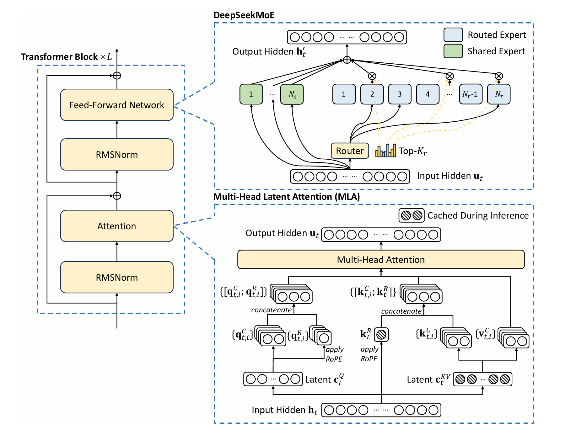
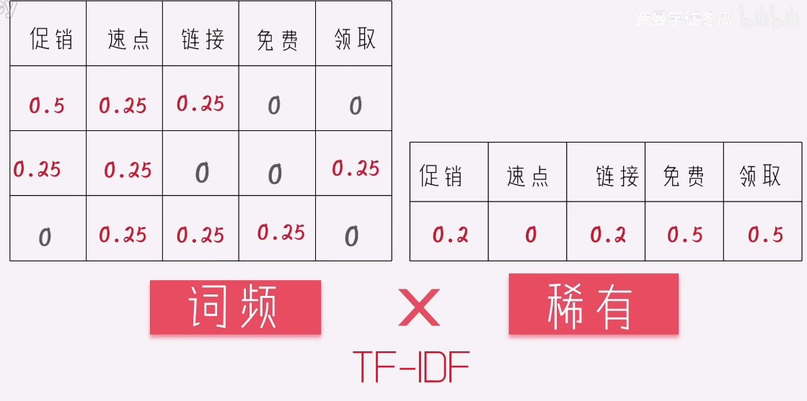
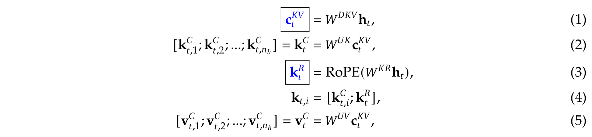
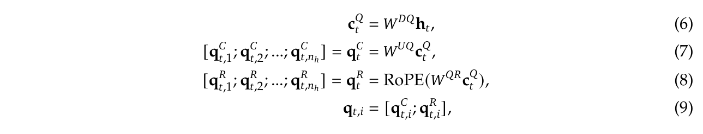
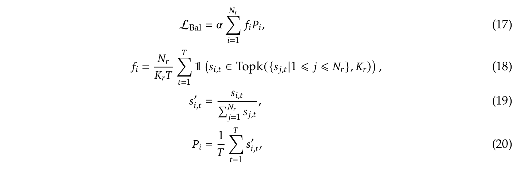
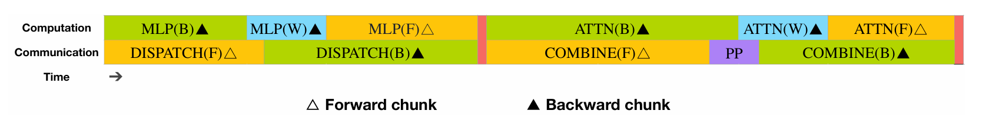
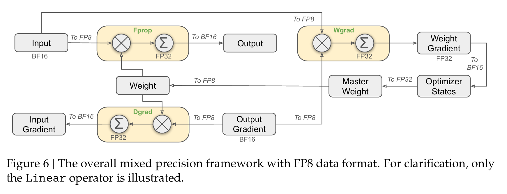
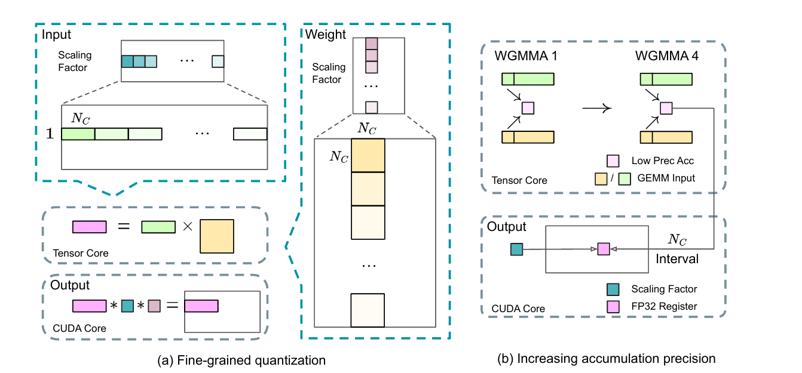

# DeepSeek-V3技术文档

> DeepSeek-V3 Technical Report
>
> 2026.5.25-

## 解决的问题

* strong model performance and economical costs.

* 在如此大规模的模型上把 FP8 训练做稳定，业界之前很少有人成功过。

------

## Intro

DeepSeek-V3, a large Mixture-of-Experts (MoE) model with 671B parameters, of which 37B are activated for each token.

### 模型架构改进

模型架构采用以下两种在V2就被验证有效的架构：

* Multi-head Latent Attention (MLA)

* DeepSeekMoE

除了以上两种基础架构以外，V3还引入了两种策略来增强模型能力：

*  auxiliary-loss-free strategy

  > 负载平衡
  > “minimizing the adverse impact on model performance that arises from the effort to encourage load balancing”

*  multi-token prediction training objective

  > 提升评估基准的整体表现
  >
  > “enhance the overall performance on evaluation benchmarks”

### 训练架构改进

DualPipe algorithm for efficient pipeline parallelism（用于高效管道并行的 DualPipe 算法）

> 通过计算通信重叠，减少管道气泡并隐藏训练期间的大部分通信（“fewer pipeline bubbles and hides most of the communication during training through computation-communication overlap”）
>
> overlap就是类似于CPU的并行流水线，如下所示：
>
> ```
> 时间轴 ──────────────────────────────────►
> 
> 计算:  [  计算A  ][  计算B  ][  计算C  ]
> 通信:            [  通信A  ][  通信B  ]
>                      ↑
>                 两者同时进行
> ```
>
> 这就是所谓的computation-communication overlap

------

#### 高效的跨节点全对全通信内核（efficient cross-node all-to-all communication kernels）

可以完全使用InfiniBand和NVLink的全部带宽，

------

#### 精细优化内存占用

使训练DeepSeek-V3时不需要使用昂贵的张量并行处理。

------

#### Pre-training & Post-training

```
  海量原始文本
      ↓
  Pre-training    ← 学语言能力（知识、逻辑、语法）
      ↓
  Base Model
      ↓
  Post-training   ← 学行为方式（听指令、对话、安全）
      ↓
  最终产品（如 DeepSeek V3 / ChatGPT）
```

在Pre-training阶段，DeepDeek-V3采用了两个阶段的上下文扩展（上下文拓展一般在完成主预训练之后）。第一阶段，拓展到32K；第二阶段，拓展到128K。

在Base Model基础上，进行Post-training阶段。该阶段包含Supervised Fine-Tuning (SFT，监督微调）和Reinforcement Learning（RL，强化学习）。此外，还蒸馏了DeepSeek-R1系列模型，同时精细保持了模型正确率和生成长度之间的平衡。

## 总体架构



Transformer Block（整体框架）

```
输入
 ↓
RMSNorm        ← 归一化
 ↓
Attention      ← 注意力机制（展开就是右下角的MLA）
 ↓
⊕              ← 残差连接（把输入直接加回来）
 ↓
RMSNorm        ← 再次归一化
 ↓
Feed-Forward   ← 前馈网络（展开就是右上角的MoE）
 ↓
⊕              ← 残差连接
 ↓
输出

以上这个Block重复 L 次
```

**本质**：这就是标准Transformer结构，DeepSeek的创新在于把里面两个核心组件换掉了。

-----

## Architecture

- [x] RMSNorm（均方根归一化）
- [x] 训练精度

- [x] 词嵌入

- [x] Multi-head Latent Attention(MLA，多头潜在注意力) 
- [x] DeepSeekMoE architectures 
- [x] Auxiliary-loss-free strategy(辅助无损失策略)
- [x] Complementary Sequence-Wise Auxiliary Loss
- [x] Node-Limited Routing
- [x] NoToken-Dropping
- [x] Multi-token prediction training objective(多标记预测训练目标)

### 一、RMSNorm

#### 先从"为什么需要归一化"说起

想象你在训练模型，数据在网络里一层一层传递：

```
第1层输出：  [0.1,  0.2,  0.3]   ← 数值很小
第2层输出：  [1.2,  3.5,  2.1]   ← 数值变大了
第3层输出：  [45,   123,  67]    ← 数值更大了
第4层输出：  [9999, 23456, ...]  ← 爆炸了！
```

数值越来越大，会导致：

- 梯度爆炸 → 训练崩溃
- 数值不稳定 → 结果乱掉

#### 归一化就是"把数值拉回正常范围"

用一个生活比喻：

> 班级考试，有人考了985分（满分100），有人考了0.3分，分数尺度完全不一样，老师没法比较。
>
> 归一化就是**把所有分数统一换算到同一个尺度**，比如0到1之间。

```
归一化前：  [0.1,  500,  23,  9999]
归一化后：  [0.11, 0.43, 0.28, 1.0]  ← 都在合理范围内
```

#### RMSNorm 具体怎么做？

RMS 是 **Root Mean Square（均方根）** 的缩写。

它的做法非常简单：

```
第一步：计算所有数值的"平均大小"（RMS）
第二步：把每个数都除以这个"平均大小"

例子：
输入：[3, 4]
RMS = √((3²+4²)/2) = √(25/2) ≈ 3.54

归一化后：
[3/3.54, 4/3.54] = [0.85, 1.13]

✓ 数值被控制住了
```

#### 为什么叫 RMS"Norm"，不用其他归一化？

常见归一化对比：

| 方法        | 做法            | 特点                 |
| ----------- | --------------- | -------------------- |
| LayerNorm   | 减均值 ÷ 标准差 | 经典，计算略复杂     |
| **RMSNorm** | **只 ÷ 均方根** | **更简单，速度更快** |
| BatchNorm   | 按batch归一化   | 不适合语言模型       |

RMSNorm 省略了"减均值"这一步，**计算量更少**，但效果几乎一样好，所以现代大模型（LLaMA、DeepSeek等）都用它。

#### 在 Transformer 里它放在哪？

```
输入数据
   ↓
RMSNorm   ← 先归一化，让数值稳定
   ↓
Attention  ← 再做复杂计算
   ↓
⊕ 残差连接
   ↓
RMSNorm   ← 再次归一化
   ↓
FFN/MoE
   ↓
⊕ 残差连接
```

每次做复杂运算**之前**先归一化，就像每次做精密实验前先**校准仪器**，保证输入数据始终在合理范围内。

#### 一句话总结

> RMSNorm 就是**防止数值在网络里越传越大、越来越乱**的"稳定器"，让每一层的输入都保持在合理范围，训练才能稳定进行。

------

### 二、训练精度（FP8）

we support the FP8 mixed precision training and implement comprehensive optimizations for the training framework.

第一次将==FP8的混合精度训练==应用到了 an extremely large-scale model

#### 优点

##### 1. 计算速度更快

- H100 GPU 的 FP8 Tensor Core 算力是 BF16 的 **2倍**
- 矩阵乘法（GEMM）吞吐量大幅提升
- 训练速度整体可提升 **30%~50%**

##### 2. 显存占用减半

- 相比 FP16/BF16，显存节省 **50%**
- 可以训练**更大的模型**，或使用**更大的 batch size**

##### 3. 通信带宽降低

- 分布式训练中，梯度通信量减少
- 对多机多卡训练尤其友好

#### 缺点

##### 1. 数值表示范围极窄

FP8 只有8位，能表示的数值范围远小于FP16：

| 格式           | 指数位 | 尾数位 | 可表示范围             |
| -------------- | ------ | ------ | ---------------------- |
| FP32           | 8位    | 23位   | ~1.2×10⁻³⁸ 到 3.4×10³⁸ |
| BF16           | 8位    | 7位    | ~1.2×10⁻³⁸ 到 3.4×10³⁸ |
| FP16           | 5位    | 10位   | ~6×10⁻⁸ 到 65504       |
| **FP8 (E4M3)** | 4位    | 3位    | **~1.95×10⁻³ 到 448**  |

##### 2. 精度损失 → 训练不稳定

- 尾数位只有3位，舍入误差大
- 梯度容易**上溢（overflow）或下溢（underflow）**
- 严重时导致训练**直接发散**

##### 3. 需要精细的 Loss Scaling

- 必须动态调整缩放因子，把数值"搬"到FP8能表示的范围内
- 实现复杂，调参困难

##### 4. 硬件支持有限

- 只有 **NVIDIA H100/H800** 及以后的GPU才有原生FP8支持
- A100 及更早的卡**不支持**，无法受益

##### 5. 并非所有算子都适合

- Softmax、LayerNorm、激活函数等对精度敏感的算子**不能用FP8**
- 需要精心设计哪些层用FP8，哪些层回退到BF16

------

### 三、词嵌入

自然语言处理（NLP）

对于以下三句话，使用不同的词袋法：


得到不同的表格：


对于日常文本中，词频高的词不一定是重要的，因此出现了词袋法的升级版:==TF-IDF==法（词频*稀有性）



词频：单个词的重复数/总词数（去重）

稀有：出现该词的文档/总文档数


==词嵌入（Word Embedding）==：

对于一部电影的评价，好和棒是一个意思，但是却会被分成两个词，在本质上是因为无法理解词义

google提出Word2Vec，如果“好”和“棒”周围经常有相同词出现，那他们就是类似的。

训练过程如下

> one-hot词编码
>           ↓
>Embedding矩阵（核心）
>           ↓
>      输出层
>           ↓
> 预测上下文词

One-hot词编码*Embedding矩阵，就类似于查表，查到当前词在Embedding矩阵的各维度信息

通过神经网络训练，最终得到词表矩阵，记录每个词的维度信息

*使用余弦相似度计算向量相关性*，这样判断词之间的相关性。


但是上述方法==没有考虑词语的顺序问题==，如：我爱你/你爱我，两句话意思完全不同。

此外也没有考虑一词多义问题，如：apple和Apple，一个水果，一个手机，使用一行就包含了多种意思，这是不可行的。


### 四、Multi-head Latent Attention (MLA)

在模型推理过程中，Key、Value矩阵需要保存下来，需要占用大量的显存空间。DeepSeekV3采用压缩K、V矩阵的方式，在生成过程中，仅需cache蓝色标记框即可。



对于Query矩阵，DeepSeek也采用压缩的方式



------

### 五、DeepSeekMoE architectures

#### 主要公式

DeepSeekMoE的最终输出公式如下：
$$
h_t' = u_t
+ \sum_{i=1}^{N_s} FFN_i^{(s)}(u_t)
+ \sum_{i=1}^{N_r} g_{i,t} FFN_i^{(r)}(u_t)
$$

| 符号          | 含义                                |
| ------------- | ----------------------------------- |
| $u_t$         | 第 t 个 token 输入 FFN 前的隐藏状态 |
| $h_t'$        | FFN层最终输出                       |
| $N_s$         | Shared Expert（共享专家）数量       |
| $N_r$         | Routed Expert（路由专家）数量       |
| $FFN_i^{(s)}$ | 第 i 个共享专家                     |
| $FFN_i^{(r)}$ | 第 i 个路由专家                     |
| $g_{i,t}$     | token 对专家 i 的门控权重           |

第一项 $u_t$:残差连接

第二项 $\sum_{i=1}^{N_s} FFN_i^{(s)}(u_t)$:共享专家输出

第三项$\sum_{i=1}^{N_r} g_{i,t} FFN_i^{(r)}(u_t)$:路由专家部分

------

DeepSeekMoE与传统MoE的差别在于：

传统MoE采用的是

>    token
>        ↓
>    Router
>        ↓
>    只选择几个专家

DeepSeekMoE采用的是

> ​            token
> ​                ↓
>
>  ┌─────────────┐
>  │       Shared专家         │ ← 永远执行
>  └─────────────┘
>
> ​                ↓
>
>  ┌─────────────┐
>  │       Routed专家         │ ← Top-K选择
>  └─────────────┘

-------

#### $g_{i,t}$是如何得到的？

##### 1、计算匹配度

首先计算匹配度$s_{i,t}$，是Router的核心：
$$
s_{i,t}=Sigmoid(u_t^T e_i)
$$
变量详解：

| 符号       | 含义                                |
| ---------- | ----------------------------------- |
| $s_{i,t}$  | token与专家i的匹配度                |
| $u_t$      | token表示                           |
| $e_i$      | 专家i的中心向量（Expert Embedding） |
| $u_t^Te_i$ | 点积相似度                          |

> 在DeepSeekV2中，采用的是==softmax==函数来计算$s_{i,t}$，而softmax函数会让专家竞争，一个专家的得分高了，其余的专家得分就低了。
>
> 因此，为了评选出Top-K的专家，DeepSeekV3采用了==Sigmoid==来为专家评分，每个专家都有自己独立的评分，更加客观。找到多个适合的专家。

##### 2、Top-K

Top-K专家的选择，使用如下公式：
$$
g'_{i,t}=
\begin{cases}
s_{i,t},&s_{i,t}\in\operatorname{Topk}(\{s_{j,t}\},K_r)\\
0,&\text{otherwise}
\end{cases}
$$
简而言之：当前专家的匹配度是前K个时，保留；反之，则将匹配度直接清零。

##### 3、权重归一化

将门控权重归一化，公式如下：
$$
g_{i,t}
=
\frac{g'_{i,t}}
{\sum_{j=1}^{N_r} g'_{j,t}}
$$
归一化的原因：不同的token得到的$g'_{i,t}$总和不一样，因此要归一化。

------

### 六、Auxiliary-Loss-Free Load Balancing（辅助无损负载平衡）

对于MoE模型而言，专家并行的场景下，专家之间不平衡的路径分配会导致routing collapse，降低计算效率。

为了解决这一问题，普遍采用辅助损失（auxiliary loss）来防止负载不平衡现象。但是，太大的辅助损失会影响模型的表现。因此，DeepSeekV3采用辅助无损负载平衡。

>简而言之，就是传统方法就是在损失函数上加了个新的损失项，这个损失项就是为了平衡各个路径之间的负载。但是这个损失项会影响模型的性能。DeepSeekV3不使用添加损失项的方式完成了路径平衡。


#### 方法详解

公式如下：
$$
g'_{i,t}
=
\begin{cases}
s_{i,t},
&
s_{i,t}+b_i
\in
\operatorname{Topk}
\left(
\{s_{j,t}+b_j \mid 1 \le j \le N_r\},
K_r
\right)
\\
0,
&
\text{otherwise}
\end{cases}
$$
该公式就是在原有计算方式的基础上，添加了一个$b_i$的偏置项，但是这一项只作为判断Top-K时使用，并不影响原本$g'_{i,t}$的值。

### 七、Complementary Sequence-Wise Auxiliary Loss（补充序列辅助损失）

> Complementary ---- 补充的，互补的
>
> Sequence-Wise ---- 逐序列的

虽然DeepSeekV3采用了Auxiliary-Loss-Free Load Balancing策略来平衡负载，但是为了防止由于某些单一sequence导致的负载不均，DeepSeekV3仍然添加了损失函数。

#### 1、Sequence-Wise是什么意思？

在MoE中有两种负载平衡技术：

* Token-Wise（更常见）：对**每一个 token**做路由

  - 每个 token 单独决定去哪个 expert

  - load balance 统计的是 token 级别分布

    > 例如:
    >
    > I → expert 3
    > love → expert 7
    > AI → expert 2


* Seqence-Wise：对**整条序列（sentence / sample）**作为单位来统计或约束

  - 直接把当前Sequence中的各个Token去向统计起来，最终只看每个Sequence中使用的不同专家数量。
  
    > 假设一条句子：“Today is sunny”
    >
    > token-wise：
    >
    > ​	Today → expert 1
    >
    > ​	is → expert 1
    >
    > ​	sunny → expert 8
    >
    > sequence-wise：
    >
    > ​	这一整句 → 主要用了 expert 1 和 8

#### 2、公式



##### （1）最终的平衡损失函数 (公式 17)

$$
\mathcal{L}_{\text{Bal}} = \alpha \sum_{i=1}^{N_r} f_i P_i
$$

- 这个公式是最终要加到总损失（Loss）中去优化惩罚项。

- **$\alpha$**：这是一个超参数（权重平衡因子）。在 DeepSeek-V3 中它被设得==极其小==，只起微调和兜底作用。

- **$f_i$ 与 $P_i$ 的乘积**：简单来说，$f_i$ 代表专家 $i$ 实际上**收到了多少流量**，而 $P_i$ 代表专家 $i$ **理论上应该被分配多少倾向度**。如果这两个向量分布越不均匀（比如某一个专家爆满，其余专家闲置），这个乘积求和的值就会非常大，从而触发惩罚。

##### （2）每个专家i的实际流量占比 $f_i$ (公式 18)

$$
f_i = \frac{N_r}{K_r T} \sum_{t=1}^{T} \mathbb{1} \left( s_{i,t} \in \text{Topk}(\{s_{j,t} | 1 \leqslant j \leqslant N_r\}, K_r) \right)
$$

- **$\mathbb{1}(\cdot)$**：指示函数（Indicator Function）。如果括号内的条件成立，它的值就是 $1$，否则就是 $0$。
- **条件部分**：$s_{i,t} \in \text{Topk}(...)$ 意思是：“对于第 $t$ 个 Token，专家 $i$ 是否属于它最倾向的前 $K_r$ 个专家之一？”
- **$\sum_{t=1}^{T}$**：把这整个序列里所有符合上述条件的 Token 数量加起来。也就是**在当前序列中，实际上有多少个 Token 真的被路由分配给了专家 $i$**。
- **前面的系数 $\frac{N_r}{K_r T}$**：这是一个归一化常数。因为总共有 $T$ 个 Token，每个 Token 选 $K_r$ 个专家，所以总分配次数是 $K_r T$。乘以 $N_r$ 是为了让 $f_i$ 在完全均衡状态下的理想期望值为 $1$。

##### （3）对于Token t归一化路由分数 $s'_{i,t}$ (公式 19)

$$
s'_{i,t} = \frac{s_{i,t}}{\sum_{j=1}^{N_r} s_{j,t}}
$$


- **含义**：这是在对路由分数做 **Softmax 类似的分母归一化**（或者直接按比例归一化）。
- 由于原始的路由分数 $s_{i,t}$ 大小不一，为了能在不同 Token 之间公平比较，将其除以当前 Token 对所有专家的分数总和。归一化后，针对某一个 Token $t$，所有专家的 $s'_{i,t}$ 相加等于 $1$。

##### （4）所有Token对专家i的路由倾向期望值 $P_i$ (公式 20)

$$
P_i = \frac{1}{T} \sum_{t=1}^{T} s'_{i,t}
$$

- **含义**：代表在当前整条序列中，**平均来看，所有 Token 对专家 $i$ 的平均偏好程度/吞吐概率**。
- 它是把序列中所有 Token 对专家 $i$ 的归一化分数求和，再除以 Token 总数 $T$。

### 八、Node-Limited Routing

DeepSeek-V3将每个Token能去往的节点数量设置了一个上限M；因此每个节点平均需要分配有$\frac{K_r}{M}$个专家

既然限制了只能去 $M$ 个节点，那怎么挑出这 $M$ 个节点呢？文本中给出了具体的筛选逻辑，我们把它翻译成大白话：

1. **看专家的亲和度（Affinity Scores）**：对于某一个 Token，它对所有专家都有一个喜爱程度的分数。
2. **按节点打包专家**：路由算法会把专家按照它们所在的物理服务器（Node）进行归类。比如，Node 1 包含专家 A/B/C，Node 2 包含专家 D/E/F。
3. **计算节点的“总印象分”**：
   - 算法不会傻傻地把一个节点上所有专家的分数都加起来（因为有些摸鱼专家分数很低，会拉低平均分）。
   - 它是取每个节点上**分数最高的 $\frac{K_r}{M}$ 个专家**（$K_r$ 是总共要选的专家数），把这几个顶尖专家的分数加起来，作为这个节点的“总分”。
4. **择优录取**：对所有节点的分数进行排序，**只挑总分最高的前 $M$ 个节点**。
5. **在选中的节点里挑专家**：这个 Token 最终要去的 $K_r$ 个专家，必须全部从这 $M$ 个被录取的节点里产生。

> [ 步骤 1：全局打分 ]   
>
> Token 对全网所有专家（如 256 个）计算亲和度分数。  
>
>  [ 步骤 2：节点归类 ]  
>
>  将所有专家按其所在的物理服务器（Node）进行分堆。  
>
>  [ 步骤 3：计算节点总分 ]   
>
> 只挑选每个 Node 里最强的 (Kr / M) 个专家，将它们的分数相加，作为该 Node 的总分。  
>
>  [ 步骤 4：节点级粗筛（Node-Limited 核心级）]【优先级最高的一刀切】  
>
> 对所有 Node 总分进行排序，只保留前 M 个 Node。 ⚠️ 此时，被淘汰 Node 里的所有专家（哪怕有全网第一名）直接被“剥夺资格”。  
>
>  [ 步骤 5：安全区内细选（Top-K 专家级）]    
>
>  在残存的 M 个 Node 内部，重新对剩下的专家进行 Top-K 排序,，最终选出 Kr 个专家执行实际计算。

### 九、No Token-Dropping

> Token-Dropping
>
> 在早期的 MoE 架构（如 Google 早期的一些 MoE 模型）中，为了防止某个专家被塞爆（负载不均），工程上设置了一个硬性死理——**专家容量上限（Expert Capacity）**。
>
> - **举个例子**：系统规定，每个专家每次最多只能处理 4 个 Token。
> - **灾难发生**：如果因为路由不均，有 6 个 Token 同时高高兴兴地跑向了同一个专家。
> - **粗暴处理**：这个专家装不下了，它会直接**把最后到的 2 个 Token 扔掉（Drop）**，不给它们做任何 MoE 层的计算。
>
> **丢弃 Token 的代价**： 虽然保护了硬件不崩盘，但在语义上这是灾难性的。被扔掉的 Token 往往变成了“乱码”或者丢失了上下文，直接导致大模型**前言不搭后语、逻辑断层，严重损伤模型精度**。

由于DeepSeek-V3的负载均衡策略，DeepSeek-V3在全量训练时展现出了很好的负载均衡。因此在训练过程中也不需要丢弃任何token。

同时，DeepSeek-V3在推理阶段也采用了推理负载均衡策略，所以在推理阶段也没有丢弃token。

### 十、Multi-token prediction training objective(多标记预测训练目标)

##### 1、MTP是什么？

传统的语言模型在训练时是**单 Token 预测（Next-Token Prediction）**：输入前面的词，只预测紧接着的下一个词（$t+1$）。

而 **MTP** 是：在每个位置，不仅预测下一个词，还要**预测未来的多个词**（$t+1, t+2, \dots, t+D$）。

##### 2、DeepSeek-V3的MTP有什么不同？

DeepSeek-V3的MTP与Gloeckle et al., 2024的MPD相比：

- **传统多预测（并行）**：

  用独立的输出头，并行、各不相干地预测后面的几个词。

- **DeepSeek 的 MTP（串行/维持因果链）**：

  采用顺序（Sequential）预测。它在预测第 $k$ 个未来的词时，会把前面已经预测出的信息融入进去，保持了完整的“因果链（Causal Chain）”。

##### 3、MTP模块

使用D个连续模块预测D个新Token。

第 $k$ 个 MTP 模块是如何工作的。

在位置 $i$，为了预测第 $k$ 个额外的 token（即第 $i+k$ 个位置的词）：

###### 步骤一：特征拼接与线性投影 (公式 21)

$$
h'{_i^k} = M_k [ \text{RMSNorm}(h_i^{k-1}) ; \text{RMSNorm}(\text{Emb}(t_{i+k})) ]
$$

- **输入1：** $h_i^{k-1}$。上一层（第 $k-1$ 层）MTP 模块在位置 $i$ 产出的表征。如果 $k=1$，它直接就是主模型（Main Model）输出的表征。

- **输入2：** $\text{Emb}(t_{i+k})$。第 $i+k$ 个真实 token 的嵌入向量（Embedding）。

- **操作：** 将这两者进行层归一化（RMSNorm）后拼接（Concatenation）在一起，然后通过一个投影矩阵 $M_k$ 映射回低维空间，得到混合表征 $h'{_i^k}$。

  > 这个投影矩阵$M_k$是模型自行在训练中学习的。DeepSeek-V3 的大模型内部所有 Transformer 块的管道宽度（特征维度）都是固定的 $d$。如果不把拼接后的 $2d$ 降回 $d$，这个特征就无法输入到后面的 $\text{TRM}_k$ 模块中。

###### 步骤二：Transformer 块处理 (公式 22)

$$
h_{1:T-k}^k = \text{TRM}_k(h'_{1:T-k})
$$

- 将拼接后的特征输入到第 $k$ 个 MTP 模块专属的 Transformer Block ($\text{TRM}_k$) 中。

- 注意这里的下标 $1:T-k$，因为是预测未来的词，所以序列长度会随着预测深度 $k$ 的增加而发生切片截断（Slicing），以保证因果关系不泄露。

  > 当深度为k时，说明预测的是未来的第K个token，需要把当前序列长度中后面K个需要预测的部分截断，不让自己看到。

  > Q：就不需要因果三角掩码了？
  >
  > A：**必须要用。** 在步骤二中，这些拼接好未来词的特征流，会被送入第 $k$ 层的 Transformer Block（$\text{TRM}_k$）。
  >
  > 由于这一步本质上还是在一个序列上做自注意力（Self-Attention）计算，为了确保位置 2 在和位置 3 交互时，绝对不会看到位置 4、位置 5 的信息，$\text{TRM}_k$ 内部**依然必须加上标准的因果三角掩码（Causal Mask）**。
  >
  > - **它的作用：** 确保在 $\text{TRM}_k$ 内部，任何一个位置 $i$ 对应的特征，在进行注意力加权时，只能看到它自己及它之前的位置（即 $1 \dots i$），右侧更高的位置全部被掩码阻断。

###### 步骤三：输出概率预测 (公式 23)

$$
P_{i+k+1}^k = \text{OutHead}(h_i^k)
$$


- 将 Transformer 块的输出 $h_i^k$ 送入输出头（$\text{OutHead}$，包含全连接层和 Softmax）。
- 最终计算出第 $k$ 个预测位置（即 $i+k$ 位置）的词表概率分布 $P$。
- **重点：** 这里的 Embedding 层和 OutHead 层是与主模型共享（Shared）的，这大大减少了参数量。

##### 4、MTP Training Objective（训练目标/损失函数）

MTP 在训练时是一个**多任务学习**的过程：主模型算自己的交叉熵损失，每个 MTP 模块也算自己的损失。

###### 单层 MTP 损失 (公式 24)

$$
\mathcal{L}_{\text{MTP}}^k = -\frac{1}{T} \sum_{i=2+k}^{T+1} \log P_i^k[t_i]
$$

这其实就是标准的交叉熵损失（Cross-Entropy Loss），计算第 $k$ 个 MTP 模块预测出的概率与真实标签 $t_i$ 之间的差距。

  $$P_i^k[t_i]$$ 表示相应 $$t_i$$的预测概率

###### 总体 MTP 损失 (公式 25)

$$
\mathcal{L}_{\text{MTP}} = \frac{\lambda}{D} \sum_{k=1}^D \mathcal{L}_{\text{MTP}}^k
$$

- 把 $D$ 个 MTP 模块的损失求平均。
- 乘以一个权重系数 $\lambda$。
- **这个损失会作为主模型训练的“辅助任务”**。它能提供更密集的训练信号，逼着主模型在理解当前词时，必须“高瞻远瞩”地考虑到未来几个词的语义，从而极大地提升主模型的**数据效率和表**

##### 5、MTP in Inference（推理时的精妙应用）

训练完了，我们在实际聊天/生成时（Inference）怎么用它？论文给出了两种极其灵活的选择：

1. **直接丢弃（白嫖流）**：

   如果你想要最稳健的常规生成，在推理时**直接把这 $D$ 个 MTP 模块扔掉**。因为主模型在训练时已经被 MTP “魔鬼训练”过了，它的基本功（表征能力）已经大大提升。不带 MTP 模块，主模型依然能独立且更强地运行。

2. **用于投机采样（加速流）**：

   不扔掉它们，而是把这 $D$ 个模块改造成投机采样（Speculative Decoding）的草稿模型（Draft Model）。让 MTP 模块一口气多吐出几个词，再让主模型一次性验证。因为它们本就保持了因果链且共享了权重，所以用它们做投机采样可以大幅降低生成延迟（Latency），让模型对答如流。


## Infrastructures

- [x] DualPipe algorithm
- [x] cross-node all-to-all communication kernels
- [x] FP8 Training
- [ ] Prefilling
- [ ] Decoding

### 一、训练框架（Training Framework）

并行方案：

- 16路流水线并行（PP）

- 在8个节点中的64路专家并行（EP）
- ZeRO-1数据并行（DP）

> 为什么DeepSeek-V3可以做到不使用TP（Tensor Parallelism）？
>
> 因为采用的MoE架构将原本巨大的FFN矩阵转化成了多个专家矩阵，从而达成每节点8路专家并行，每路专家并行包含4个专家。

对于PP，DeepSeek-V3推出了DualPipe algorithm，这一方案不仅有更少的流水线气泡，而且将前向与反向传播时的数据传输与计算并行进行，从而解决在MoEt架构上会出现的传输压力。

cross-node all-to-all communication kernels可以完全释放IB和NVLink的带宽，并且减轻SM在通信上的浪费。

#### 1、双流水线算法（DualPipe algorithm）

主要思想

将计算和传输分开来，将其并行。

> **Chunk**
>
> 一个batch会在流水线中被切分成多个micro-batch。chunk就是指一个micro-batch在流水线中的一步。



对于图片中的反向传播分为两类：

- （B）计算的是$\frac{\partial L}{\partial X}$，目的是**将梯度向前传递**
- （W）计算的是$\frac{\partial L}{\partial W}$，目的是为了**更新当前层梯度**（因此不需要dispatch和combine）

> 这张图不能理解为初始执行顺序，只是在执行过程中的截图。
>
> 在上一阶段**A**的MLP反向传播【MLP（B/W）】正在计算时，可以传输当前阶段**B**的attention结果，分发到各个装载不同专家的GPU上。
>
> 在当前层**B**的MLP开始前向传播的计算时，通信管线开始传输合并（虽然叫DISPATCH，其实是为了表明是前向DISPATCH在反向传播的逆序版本，没改名字，逻辑上是合并）上一层**A**刚刚计算完的反向传播的MLP（B）结果。
>
> 红色分割线|
>
> 当计算管线开始计算上一层**A**反向传播的attention层的梯度时【ATTENTION（B/W）】，通信管线开始传输合并上一拍所有GPU计算完的前向传播MLP结果。
>
> 合并完前向传播的结果，意味着当前层要向下一阶段**C**传播了，需要流水线并行处理，传输数据到下一层。紫色PP表示流水线传输数据到下一阶段**C**。
>
> 下一阶段**C**开始计算注意力，同时开始**B**阶段的反向传播的数据传输，先将数据分发给不同专家的GPU，写着是COMBINE实则是DISPATCH。
>
> 如此往复。

#### 2、跨节点全连接通信（Cross-Node All-to-All Communication）

在节点内DeepSeek使用NVLink，NVLink带宽高达160GB/s。在节点间，GPUs用IB连接，带宽只有50GB/s。

为充分利用各个协议的带宽，DeepSeek-V3将每个Token可以分发到的节点上限限制为4个。

#### 3、以最小的开销极大地节省内存（Extremely Memory Saving with Minimal Overhead）

- Recomputation of RMSNorm and MLA Up-Projection. （RMSNorm 和 MLA 上投影的重新计算。）
- Exponential Moving Average in CPU.（CPU 中的指数移动平均线）
- Shared Embedding and Output Head for Multi-Token Prediction. （用于多标记预测的共享嵌入和输出头。）

###  二、FP8 Training

量化策略：

- tile-wise（$1 \times N_c$）
- block-wise($N_c \times N_c$)

#### 1、混合精度架构（Mixed Precision Framework）



图中三个核心计算（黄色模块）

| 模块      | 全称                | 作用             |
| --------- | ------------------- | ---------------- |
| **Fprop** | Forward Propagation | 前向传播，算输出 |
| **Wgrad** | Weight Gradient     | 计算权重的梯度   |
| **Dgrad** | Data/Input Gradient | 计算输入的梯度   |

每个模块内部都是：**乘法（⊗）→ 累加（Σ，FP32）**，即矩阵乘法用FP8做，但累加用FP32保证精度。


数据流解读

🔵 前向传播（上半部分）

```
Input(BF16) → 转FP8 → Fprop → 转BF16 → Output
Weight       → 转FP8 ↗
```

- 输入和权重都转成FP8再做矩阵乘法
- 输出结果转回BF16

🔴 反向传播（下半部分）

```
Output Gradient(BF16) → 转FP8 → Dgrad → 转BF16 → Input Gradient
Weight                → 转FP8 ↗

Output Gradient → 转FP8 → Wgrad → FP32 → Weight Gradient → 转BF16
Input(FP8缓存)  → 转FP8 ↗
```

🟡 权重更新（右侧）

```
Weight Gradient(FP32) → Optimizer States → Master Weight(FP32) → 转FP8 → Weight
```

- 优化器状态和主权重用**FP32**保持高精度
- 更新完再转FP8供下次计算使用

#### 2、 Improved Precision from Quantization and Multiplication（通过量化和乘法提高精度）



##### （1）细粒度量化（Fine-Grained Quantization）

**问题：** 传统方法用整个张量的最大值来计算缩放因子，遇到**异常大的数值（outliers）** 时，其他正常数值的精度会严重受损。

**解决：** 缩小分组粒度，分别对小块数据计算缩放因子：

| 数据类型 | 分组方式               | 含义                                      |
| -------- | ---------------------- | ----------------------------------------- |
| 激活值   | $1 \times 128$ tile    | 每个token，每128个channel一组             |
| 权重     | $128 \times 128$ block | 每128个输入channel × 128个输出channel一组 |

局部异常值只影响本组，不会"污染"其他组的精度。

##### （2）提升累加精度（Increasing Accumulation Precision）

**问题：** H800 GPU的Tensor Core做FP8矩阵乘法时，累加精度只有约**14bit**，远低于FP32。当矩阵内维度K很大时（大模型训练的常见场景），误差可达**2%**。

**解决：** 每累加 $N_c = 128$ 个元素后，把中间结果**从Tensor Core搬到CUDA Core**，用完整FP32精度继续累加。

```
Tensor Core（FP8乘法）→ 每128步 → CUDA Core（FP32累加）→ 最终结果
```

同时，两个warpgroup交替工作（一个做搬运，一个继续计算），保证Tensor Core利用率不下降。

##### （3）统一用E4M3格式（Mantissa over Exponents）

**问题：** 前人方案在不同阶段用不同FP8格式：

- Fprop用E4M3（精度高）1位符号+4位指数+3位尾数
- Dgrad和Wgrad用E5M2（动态范围大）1位符号+5位指数+2位尾数

**DeepSeek的做法：** 全部统一用**E4M3**，优先保精度而非动态范围。

**为什么可行？** 因为细粒度分组本身已经相当于在组内"共享指数位"，动态范围的问题已由分组缩放因子解决，不再需要E5M2的大动态范围。

##### （4）在线量化（Online Quantization）

**问题：** 传统"延迟量化"用**历史最大值**来估算当前缩放因子，不够准确，还让框架变复杂。

**解决：** 每次实时计算当前这批数据的最大绝对值，**即时推导缩放因子，即时量化**：

```
当前数据 → 实时算max → 实时算缩放因子s → 立刻量化为FP8
```

保证缩放因子始终准确，框架也更简洁。

#### 3、 Low-Precision Storage and Communication

##### （1）低精度优化器状态

**AdamW优化器**需要维护两个"动量"：

- 一阶矩（梯度的均值）
- 二阶矩（梯度的方差）

| 数据                    | 原来 | DeepSeek | 原因                 |
| ----------------------- | ---- | -------- | -------------------- |
| 一阶矩、二阶矩          | FP32 | **BF16** | 对精度不敏感，省显存 |
| 主权重（Master Weight） | FP32 | **FP32** | 权重更新需要高精度   |
| 梯度（用于梯度累积）    | FP32 | **FP32** | 数值稳定性关键       |

##### （2）低精度激活值存储

大原则是激活值尽量用FP8存，但有两个例外：

例外1：Attention层之后的Linear输入

- 这个激活值**同时被两个反向传播用到**（Linear的反向 + Attention的反向）
- Attention反向对精度更敏感
- 所以用专门设计的**E5M6**格式（5位指数+6位尾数，比E4M3精度更高）
- 缩放因子必须是**2的整数次幂**，避免转置时引入额外误差

例外2：MoE中SwiGLU算子的输入

- 不直接缓存SwiGLU的输出，而是：

  ```
  缓存输入（FP8）→ 反向传播时重新计算输出
  ```

- 用计算换显存，输入仍用FP8细粒度量化存储

##### （3）低精度通信

MoE模型的瓶颈之一是**不同专家之间的数据传输**（dispatch/combine）：

```
前向传播：
激活值 → FP8量化 → dispatch传输 → MoE上投影（FP8 Fprop）

反向传播：
激活值梯度 → FP8量化 → 传输 → MoE下投影
```

但combine（汇聚结果）阶段保留BF16：

| 操作             | 精度     | 原因                 |
| ---------------- | -------- | -------------------- |
| Dispatch（分发） | FP8      | 减少通信量           |
| MoE上投影/下投影 | FP8      | 与Fprop兼容          |
| Combine（汇聚）  | **BF16** | 训练关键路径，保精度 |

缩放因子同样要求是**2的整数次幂**。

##### （4）整体设计逻辑

```
能用FP8的地方 → 全用FP8（省显存、省通信）
精度敏感的地方 → 保BF16或用E5M6（保稳定性）
权重和梯度    → 保FP32（保训练收敛）
```

本质上是在**显存、通信带宽、训练精度**三者之间做精细的权衡，而不是一刀切地降低所有精度。


### 三、推理和部署（ Inference and Deployment）

先理解两个阶段的区别

```
Prefilling（预填充）：处理输入的prompt，一次性并行计算所有token
Decoding（解码）：  逐个生成输出token，一次生成一个
```

两者的计算特点不同，因此部署策略也不同。

#### 1、Prefilling

基本配置

最小部署单元：**4节点，32块GPU**

| 部分          | 并行策略       | 说明                                |
| ------------- | -------------- | ----------------------------------- |
| Attention     | TP4 + SP + DP8 | TP只用4路，控制通信开销             |
| MoE           | EP32           | 每个专家处理足够大的batch，提升效率 |
| 浅层dense MLP | TP1            | 不做张量并行，节省通信              |

负载均衡：冗余专家机制

MoE的问题：不同专家被选中的频率不同，导致部分GPU过载。


解决方案：

```
统计高负载专家 → 复制一份部署到其他GPU → 每10分钟更新一次
```

DeepSeek-V3设置了**32个冗余专家**，每块GPU除原有8个专家外，额外多承载1个冗余专家。

提升吞吐：双micro-batch并行

```
micro-batch A：做Attention和MoE计算
micro-batch B：做dispatch和combine通信
两者同时进行，互相掩盖对方的耗时
```

未来探索：动态冗余

每块GPU预载16个专家，但每步只激活9个，路由方案实时全局最优计算。Prefilling计算量大，路由计算开销几乎可以忽略。


#### 2、Decoding

基本配置

最小部署单元：**40节点，320块GPU**（比Prefilling大得多）

| 部分      | 并行策略                      |
| --------- | ----------------------------- |
| Attention | TP4 + SP + DP80               |
| MoE       | EP320，每块GPU只放**1个专家** |

共享专家被当作"始终被选中的高负载路由专家"处理，64块GPU专门负责冗余专家和共享专家。

通信方式

- 用**点对点IB直连**做dispatch/combine，降低延迟
- 引入**IBGDA技术**进一步减少延迟


Decoding的特殊性

```
Prefilling瓶颈：计算（大矩阵并行）
Decoding瓶颈：内存访问（每次只生成1个token，计算量小）
```

因此Decoding的双micro-batch策略与Prefilling不同：

```
micro-batch A：做Attention（耗时长）
micro-batch B：做dispatch + MoE + combine（耗时短）
```

MoE部分只需加载1个专家的参数，内存访问开销小，所以**只分配少量SM**给MoE，把更多SM留给Attention，不影响整体速度。


两阶段对比总结

|             | Prefilling             | Decoding             |
| ----------- | ---------------------- | -------------------- |
| 规模        | 32 GPU                 | 320 GPU              |
| 瓶颈        | 计算                   | 内存访问             |
| 每GPU专家数 | 8+1个                  | 1个                  |
| 通信方式    | IB跨节点+NVLink节点内  | 点对点IB直连         |
| overlap策略 | Attention与MoE互相掩盖 | Attention掩盖MoE通信 |

#### 


## 疑问

- [ ] DualPipe图中，通信管线在将计算完MLP（B）之后为什么命名还是DISPATCH（B），从语义理解上分析，应该是COMBINE（B）？可能是直接把前向传播的DISPATCH直接拿过来了？
